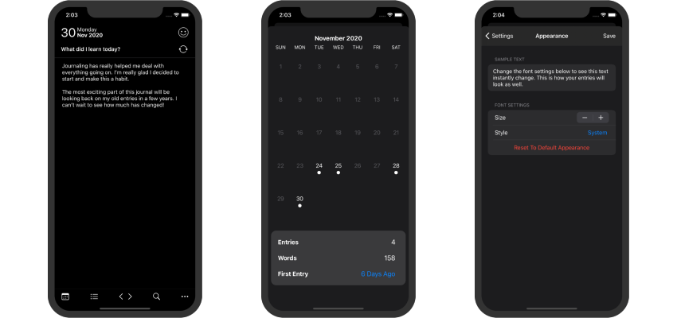

# JRNL - [Download on the App Store](https://apps.apple.com/us/app/jrnl-minimalist-journal/id1541567042)

## About the app

### JRNL

JRNL is a minimalist daily journaling app. It allows users to write entries using given prompts and attach a mood to each entry. Users can also look back on and search through previous journal entries.

### How it works

The app uses Realm for data storage and persistence. Each entry in the database is given a timestamp, prompt, mood, and content. From there the entries can be sorted, queried, and edited.

 

## Concepts used

* UIKit
* Dark Mode
* Working with tableviews and textviews
* Data persistence using Realm

### Features:

- [x] Mood tracker
- [x] Calendar view and selector
- [x] List view and selector
- [x] Search entries by content
- [x] Search entries by mood
- [x] Reminder notifications
- [x] Passcode protection
- [x] Font styling
- [ ] Automatic mood detection
- [ ] User created prompts
- [ ] Add photos to entries

 
 

>Check my other projects and full portfolio at [nipun.io](https://nipun.io).

 
